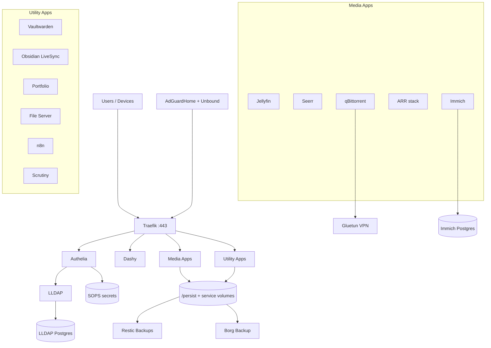

<div align="center">


**NixOS Configuration for QGroget Infrastructure**

*Reproducible, declarative systems for desktop computing and homelab services*


</div>

---

## 🏠 Why This Configuration Exists

This repository defines the full QGroget environment with **Nix flakes**:
- multiple desktop machines
- one main homelab server
- reusable modules under `modules/`

The goal is to keep systems reproducible, versioned, and easy to rebuild.

## 🗂️ Repository Structure

- `flake.nix`: host wiring, shared modules, checks
- `hosts/<name>/`: host-specific system configuration
- `modules/`: reusable modules (desktop, server, apps, services)
- `secrets/`: encrypted secrets managed with `sops-nix`
- `tests/`: NixOS integration checks

## 🖥️ Server Configuration (host: `Server`)

Server config is composed from:
- `/home/runner/work/nixos-config/nixos-config/hosts/Server/configuration.nix`
- `/home/runner/work/nixos-config/nixos-config/modules/server/default.nix`
- imported feature modules under `/home/runner/work/nixos-config/nixos-config/modules/server/*`

### Core platform
- **Ingress / TLS**: Traefik (Let's Encrypt, dynamic routers generated from `qgroget.services`)
- **Authentication**: Authelia + LLDAP (OIDC and LDAP)
- **Containers**: Podman + Quadlet
- **Persistence**: `/persist` + per-service persistent directories
- **Secrets**: SOPS (`secrets/secrets.yaml`) with runtime injection
- **Backups**: Restic coordinator + Borg backup job
- **Network services**: AdGuardHome + Unbound DNS

## 📦 Installed & Configured Server Services

### Access / Identity
- Traefik (`proxy.qgroget.com`)
- Authelia (`auth.qgroget.com`)
- LLDAP (`lldap.qgroget.com`)

### Media stack
- Jellyfin (`jellyfin.qgroget.com`)
- Seerr / Jellyseerr (`seerr.qgroget.com`)
- Immich (`immich.qgroget.com`)
- ARR stack: Sonarr, Radarr, Sonarr-anime, Radarr-anime, Bazarr, Prowlarr, Questarr, Qui

### Download / transfer
- qBittorrent instances (via Gluetun VPN)

### Utility / apps
- Dashy (`qgroget.com`)
- Vaultwarden (`vaultwarden.qgroget.com`)
- Obsidian LiveSync (`obsidian.qgroget.com`)
- Portfolio (`portfolio.qgroget.com`)
- File server (`file.qgroget.com`)
- Scrutiny (`scrutiny.qgroget.com`)
- n8n (`n8n.qgroget.com`)
- AdGuardHome (`adguardhome.qgroget.com`)
- Glances (`top.qgroget.com`)

## 🕸️ Architecture Graph


```mermaid
flowchart TD
  U[Users / Devices] --> T[Traefik :443]
  T --> A[Authelia]
  A --> L[LLDAP]

  T --> D[Dashy]
  T --> M[Media Apps]
  T --> W[Utility Apps]

  subgraph Media Apps
    J[Jellyfin]
    S[Seerr]
    I[Immich]
    R[ARR stack]
    Q[qBittorrent]
  end

  subgraph Utility Apps
    V[Vaultwarden]
    O[Obsidian LiveSync]
    P[Portfolio]
    F[File Server]
    N[n8n]
    C[Scrutiny]
  end

  Q --> G[Gluetun VPN]
  A --> DS[(SOPS secrets)]
  L --> PG[(LLDAP Postgres)]
  I --> IPG[(Immich Postgres)]

  M --> PERSIST[(/persist + service volumes)]
  W --> PERSIST

  PERSIST --> B[Restic Backups]
  PERSIST --> BB[Borg Backup]
  DNS[AdGuardHome + Unbound] --> T
```

## 🚀 Quick Start

```bash
# Clone
git clone https://github.com/Strange500/nixos-config.git ~/nixos

# List outputs
nix flake show ~/nixos

# Build and switch (replace hostname)
sudo nixos-rebuild switch --flake ~/nixos#Server
```

## ✅ Checks

```bash
# Example flake check targets
nix build .#checks.x86_64-linux.jellyfinTest
nix build .#checks.x86_64-linux.jellyseerrTest
```
