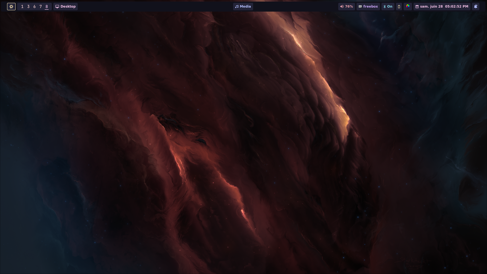

# ❄️ Strange500's NixOS Configuration

<div align="center">


*My personal reproducible, declarative & pure NixOS setup*

**🎯 Focused on Development • 🚀 Performance • 🔒 Security**

</div>

---

## 🚀 Quick Start

```bash
# Clone the repository
git clone https://github.com/Strange500/nixos-config.git ~/nixos
# Build and switch (replace with your hostname)
sudo nixos-rebuild switch --flake ~/nixos#your-hostname
```

## ✨ Features

### 🖥️ **Desktop Environment**
- **Window Manager**: Hyprland
- **Terminal**: Kitty
- **Shell**: Zsh with Oh My Zsh
- **Editor**: LunarVim
- **Browser**: Brave with preinstalled extensions

### 🛠️ **Development Environment**
- **Containers**: Docker with rootless configuration
- **Version Control**: Git with preconfigured ssh keys using sops
- **IDE**: IntelliJ IDEA
- **Dependency Management**: Devbox for virtual environments

### 🔒 **Security & Privacy**
- **VPN**: Tailscale
- **Secrets**: Age-encrypted secrets management with sops

### 🎨 **Aesthetics**
- **Fonts**: JetBrains Mono Nerd Font
- **Wallpapers**: Dynamic wallpaper rotation
- **Desktop Overlay**: HyprPanel

## 🏗️ System Specifications

| Component | Specification        |
|-----------|----------------------|
| **OS** | NixOS 24.11 (Vicuna) |
| **Init** | systemd              |
| **Shell** | Zsh                  |
| **WM** | Hyprland             |
| **Terminal** | Kitty                |
| **Editor** | LunarVim             |

## 📦 Included Packages

<details>
<summary>🖥️ <b>Desktop Applications</b></summary>

- **Browser**: Firefox
- **Communication**: Discord
- **Media**: mpv
- **VM**: QEMU/KVM with virt-manager

</details>

<details>
<summary>🛠️ <b>Development Tools</b></summary>

- **Git Ecosystem**: Git, Lazygit
- **Containers**: Docker, Docker Compose

</details>

<details>
<summary>🔧 <b>System Utilities</b></summary>

- **System Monitoring**: btop, fastfetch
- **File Management**: yazi, bat
- **Archive Tools**: unzip, unrar
- **Network**: wget, curl, rsync

</details>

## 🚀 Installation Guide

## Manual Installation

### Prerequisites
- NixOS installed with flakes enabled
- Git configured with your credentials

### Step 1: Clone the Repository
If you are starting from scratch, you can clone the repository directly into your NixOS configuration directory:
```bash
git clone https://github.com/strange500/nixos-config nixos
```

### Step 2: Install 
Put your age keys in the following file:
```bash
sudo nixos-rebuild switch --flake ~/nixos#your-hostname
```

### Step 3: Post-Installation
Setup age key file
```bash
mkdir -p ~/.config/sops/age
echo "your-age-key" > ~/.config/sops/age/keys.txt
update
```

now just reboot

## Remote Installation

### Step 1: Clone the Repository
If you are starting from scratch, you can clone the repository directly into your NixOS configuration directory:
```bash
git clone https://github.com/strange500/nixos-config nixos
```

(you may check disko config according to your needs) the client should be accessible via ssh, you can generate the installer iso 
```bash
using nix build .#nixosConfigurations.installer.config.system.build.isoImage
```
### Step 2: Install using nix-anywhere
```bash
Put your age keys in the following file:
```bash
nix run nixpkgs#nixos-anywhere -- --flake .#host --generate-hardware-config nixos-generate-config ./hardware-configuration.nix root@ip-address
```
If you need Luks and use tpm2 for disk encryption, reboot inside the live cd and type:
```bash
systemd-cryptenroll --tpm2-device=auto --tpm2-pcrs=0 /dev/<device>
```
do it for all partition that requires encryption

### Step 3: Post-Installation

Setup age key file
```bash
mkdir -p ~/.config/sops/age
echo "your-age-key" > ~/.config/sops/age/keys.txt
```

to rebuil host remotely use:
```bash
nixos-rebuild --target-host user@example.com switch -- flake .#nixosconfig 
```


## 🔧 Customization

### Adding a New Host
1. Create a new directory in `hosts/`
2. Copy an existing configuration as a template
4. Add the host to `flake.nix`


## 🏠 About This Configuration

This is my personal NixOS configuration that I use across multiple machines. It emphasizes:

- **Minimalism**: Clean, distraction-free environments
- **Performance**: Optimized for development workflows
- **Security**: Hardened configurations with proper secret management
- **Reproducibility**: Every machine setup is identical and version-controlled

The configuration is designed to work well for software development, with particular focus on modern web development, systems programming, and DevOps workflows.

## 📸 Screenshots

<details>
<summary>🖥️ <b>Desktop Environment</b></summary>




</details>


## 📚 Resources

- [NixOS Manual](https://nixos.org/manual/nixos/stable/)
- [Nix Package Search](https://search.nixos.org/)
- [Home Manager Options](https://nix-community.github.io/home-manager/options.html)
- [NixOS Wiki](https://nixos.wiki/)
- [Hyprland Wiki](https://wiki.hyprland.org/)

## 📄 License

This configuration is licensed under the MIT License - see the [LICENSE](LICENSE) file for details.
